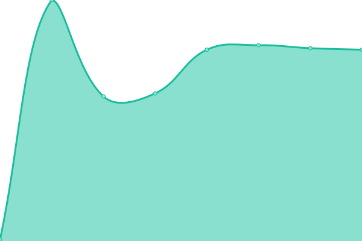
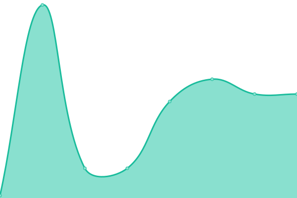

# [📈 Live Status](https://Exorcism0666.github.io/uptime): <!--live status--> **🟧 Partial outage**

This repository contains the open-source uptime monitor and status page for [兄駈主皇硫詞駿](https://Exorcism0666.github.io/uptime), powered by [Upptime](https://github.com/upptime/upptime).

With [Upptime](https://upptime.js.org), you can get your own unlimited and free uptime monitor and status page, powered entirely by a GitHub repository. We use [Issues](https://github.com/Exorcism0666/uptime/issues) as incident reports, [Actions](https://github.com/Exorcism0666/uptime/actions) as uptime monitors, and [Pages](https://Exorcism0666.github.io/uptime) for the status page.

<!--start: status pages-->
<!-- This summary is generated by Upptime (https://github.com/upptime/upptime) -->
<!-- Do not edit this manually, your changes will be overwritten -->
<!-- prettier-ignore -->
| URL | Status | History | Response Time | Uptime |
| --- | ------ | ------- | ------------- | ------ |
|  [Riiconnect24](167.86.108.126) | 🟩 Up | [riiconnect24.yml](https://github.com/Exorcism0666/UpTime/commits/HEAD/history/riiconnect24.yml) | 

 139ms
     
 | 

<a href="https://exorcism0666.github.io/UpTime/history/riiconnect24">100.00%</a>
    

|  [Wiimmfi](95.217.77.181) | 🟩 Up | [wiimmfi.yml](https://github.com/Exorcism0666/UpTime/commits/HEAD/history/wiimmfi.yml) | 

 155ms
     
 | 

<a href="https://exorcism0666.github.io/UpTime/history/wiimmfi">100.00%</a>
    

|  [Riiconnect24 (old)](164.132.44.106) | 🟩 Up | [riiconnect24-old.yml](https://github.com/Exorcism0666/UpTime/commits/HEAD/history/riiconnect24-old.yml) | 

 134ms
     
 | 

<a href="https://exorcism0666.github.io/UpTime/history/riiconnect24-old">100.00%</a>
    

|  [str2hax](18.188.135.9) | 🟥 Down | [str2hax.yml](https://github.com/Exorcism0666/UpTime/commits/HEAD/history/str2hax.yml) | 

 0ms
     
 | 

<a href="https://exorcism0666.github.io/UpTime/history/str2hax">0.02%</a>
    

|  [FlashHax](https://flashhax.com/) | 🟩 Up | [flash-hax.yml](https://github.com/Exorcism0666/UpTime/commits/HEAD/history/flash-hax.yml) | 

 204ms
     
 | 

<a href="https://exorcism0666.github.io/UpTime/history/flash-hax">100.00%</a>
    

|  [Loadiine](loadiine.ovh) | 🟩 Up | [loadiine.yml](https://github.com/Exorcism0666/UpTime/commits/HEAD/history/loadiine.yml) | 

 643ms
     
 | 

<a href="https://exorcism0666.github.io/UpTime/history/loadiine">100.00%</a>
    

|  [WiiuExploit](http://wiiuexploit.xyz) | 🟩 Up | [wiiu-exploit.yml](https://github.com/Exorcism0666/UpTime/commits/HEAD/history/wiiu-exploit.yml) | 

 4ms
     
 | 

<a href="https://exorcism0666.github.io/UpTime/history/wiiu-exploit">100.00%</a>
    

|  [Dumpling Web Launcher](https://dumplingapp.com/) | 🟩 Up | [dumpling-web-launcher.yml](https://github.com/Exorcism0666/UpTime/commits/HEAD/history/dumpling-web-launcher.yml) | 

 187ms
     
 | 

<a href="https://exorcism0666.github.io/UpTime/history/dumpling-web-launcher">100.00%</a>
    

|  [4TU DNS](45.55.142.122) | 🟩 Up | [4-tu-dns.yml](https://github.com/Exorcism0666/UpTime/commits/HEAD/history/4-tu-dns.yml) | 

 56ms
     
 | 

<a href="https://exorcism0666.github.io/UpTime/history/4-tu-dns">100.00%</a>
    

|  [WiiDB Haxx](http://u.wiidb.de/) | 🟩 Up | [wii-db-haxx.yml](https://github.com/Exorcism0666/UpTime/commits/HEAD/history/wii-db-haxx.yml) | 

 420ms
     
 | 

<a href="https://exorcism0666.github.io/UpTime/history/wii-db-haxx">100.00%</a>
    

<!--end: status pages-->

[**Visit our status website →**](https://Exorcism0666.github.io/uptime)

## 📄 License

- Powered by: [Upptime](https://github.com/upptime/upptime)
- Code: [MIT](./LICENSE) © [兄駈主皇硫詞駿](https://Exorcism0666.github.io/uptime)
- Data in the `./history` directory: [Open Database License](https://opendatacommons.org/licenses/odbl/1-0/)
